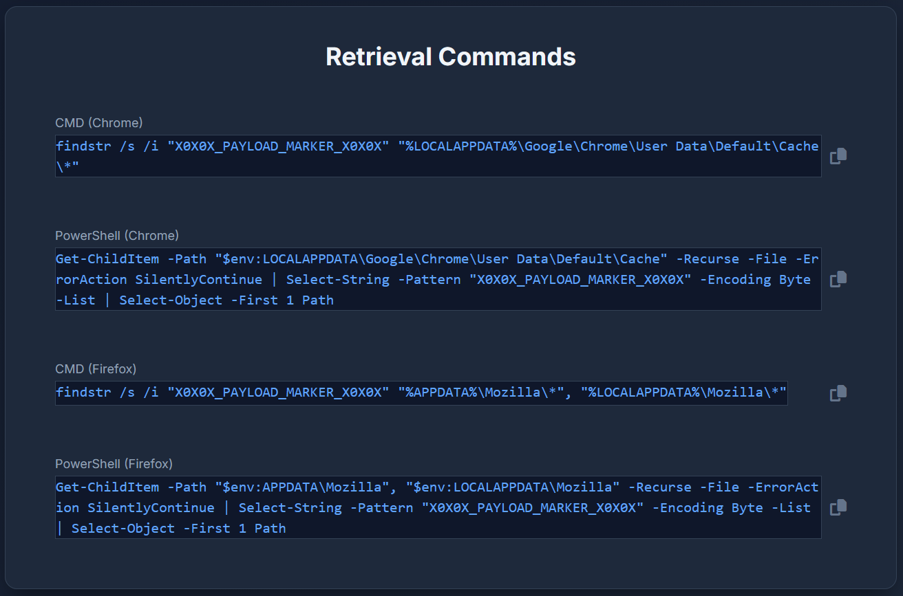
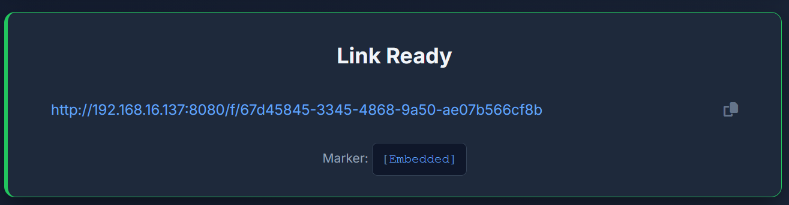

# Nakba - Advanced MoTW Bypass Framework


## Overview

Nakba is a sophisticated Mark-of-the-Web (MoTW) bypass framework designed for authorized security testing and red team operations. The platform enables security professionals to deliver payloads through browser cache mechanisms, effectively bypassing traditional download detection and security controls.

## Features

- **Advanced MoTW Bypass**: Leverages browser caching mechanisms to bypass Windows security controls
- **Multi-Browser Support**: Includes commands for both Chrome and Firefox browsers
- **Stealth Delivery**: Bypasses download warnings and traditional detection methods
- **Payload Tracking**: Embedded signature for operational tracking
- **Dark Theme UI**: Professional, modern interface with beautiful dark aesthetics
- **Secure Architecture**: Implements rate limiting and input validation

## Screenshots

### Main Dashboard


### Payload Upload Interface


### Command Retrieval


## Installation

### Prerequisites

- Python 3.7+
- pip package manager
- Git (optional, for cloning)

### Setup Instructions

1. **Clone the repository**
   ```bash
   git clone https://github.com/ydy4/Nakba.git
   cd Nakba
   ```

2. **Install dependencies**
   ```bash
   pip install flask
   ```

3. **Verify installation**
   ```bash
   python -c "import flask; print('Flask version:', flask.__version__)"
   ```

## Usage

### Starting the Server

1. **Navigate to the project directory**
   ```bash
   cd Nakba
   ```

2. **Run the server**
   ```bash
   python server.py
   ```

3. **Access the application**
   - Open your browser and navigate to `http://localhost:8080`
   - The server will be accessible on port 8080 by default

### Operational Workflow

1. **Upload your implant file**
   - Click "Select Payload" or drag and drop your file
   - Supported formats: All file types accepted

2. **Generate a download link**
   - Click "Generate Delivery Link" button
   - The system will append the payload marker signature

3. **Download your file without MoTW**
   - Use the provided commands to locate the payload in browser cache
   - Commands available for both Chrome and Firefox browsers

### Payload Retrieval Commands

#### Chrome Browser
- **PowerShell Command**:
  ```powershell
  Get-ChildItem -Path "$env:LOCALAPPDATA\Google\Chrome\User Data\Default\Cache" -Recurse -File -ErrorAction SilentlyContinue | Select-String -Pattern "X0X0X_PAYLOAD_MARKER_X0X0X" -Encoding Byte -List | Select-Object -First 1 Path
  ```

- **CMD Command**:
  ```cmd
  findstr /s /i "X0X0X_PAYLOAD_MARKER_X0X0X" "%LOCALAPPDATA%\Google\Chrome\User Data\Default\Cache\*"
  ```

#### Firefox Browser
- **PowerShell Command**:
  ```powershell
  Get-ChildItem -Path "$env:APPDATA\Mozilla", "$env:LOCALAPPDATA\Mozilla" -Recurse -File -ErrorAction SilentlyContinue | Select-String -Pattern "X0X0X_PAYLOAD_MARKER_X0X0X" -Encoding Byte -List | Select-Object -First 1 Path
  ```

- **CMD Command**:
  ```cmd
  findstr /s /i "X0X0X_PAYLOAD_MARKER_X0X0X" "%APPDATA%\Mozilla\*" "%LOCALAPPDATA%\Mozilla\*"
  ```

## Security Features

- **Rate Limiting**: Prevents abuse with 10 requests per minute per IP
- **File Size Validation**: Maximum 50MB file upload limit
- **Path Traversal Protection**: Safe file path joining
- **Input Sanitization**: XSS prevention for dynamic content
- **UUID Validation**: Secure file identifier generation

## Configuration

The application can be configured by modifying the following constants in `server.py`:

- `SIGNATURE`: The payload marker signature (default: `X0X0X_PAYLOAD_MARKER_X0X0X`)
- `UPLOAD_FOLDER`: Directory for storing uploaded files (default: `uploads`)
- `RATE_LIMIT`: Maximum requests per minute per IP (default: 10)
- `RATE_WINDOW`: Time window for rate limiting in seconds (default: 60)

## Architecture

### Components

- **Frontend**: Modern UI with dark theme using Tailwind CSS
- **Backend**: Flask-based server with secure file handling
- **Storage**: Local file system with UUID-based naming
- **Security**: Multiple layers of validation and protection

### Technology Stack

- **Backend**: Python Flask
- **Frontend**: HTML5, CSS3, JavaScript
- **Styling**: Tailwind CSS with custom dark theme
- **Icons**: Font Awesome
- **Security**: Built-in validation and rate limiting

## Authorization Notice

This tool is intended solely for authorized security testing and research purposes. The author assumes no responsibility for any misuse or damage resulting from its use. Users are responsible for ensuring compliance with all applicable laws and regulations in their jurisdiction.

## Contributing

Contributions are welcome! Please follow these steps:

1. Fork the repository
2. Create a feature branch (`git checkout -b feature/amazing-feature`)
3. Commit your changes (`git commit -m 'Add amazing feature'`)
4. Push to the branch (`git push origin feature/amazing-feature`)
5. Open a Pull Request

## License

This project is licensed under the MIT License - see the LICENSE file for details.

## Support

For support, please open an issue in the GitHub repository or contact the maintainers.

## Disclaimer

The authors and contributors are not responsible for any illegal use of this tool. This software is intended for educational and authorized security testing purposes only. Misuse of this tool may violate local, state, and federal laws. Use responsibly and ethically.

## Version History

- **v1.0.0**: Initial release with core MoTW bypass functionality
- **v1.1.0**: Added multi-browser support and enhanced UI
- **v1.2.0**: Implemented security enhancements and rate limiting
- **v1.3.0**: Added dark theme and improved UX

---

<p align="center">
  <em>Nakba - Advanced MoTW Bypass Framework</em><br>
  <strong>For authorized security testing and research purposes only</strong>
</p>