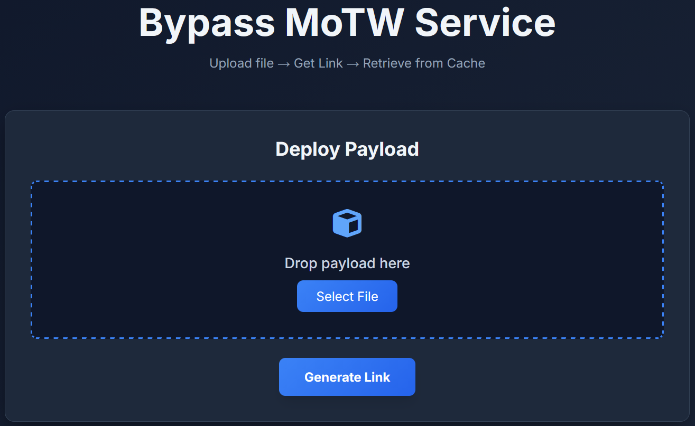

# Nakba
*Mark-of-the-Web (MoTW) Bypass as a Service*

[](https://www.python.org/)
[](https://flask.palletsprojects.com/)
[](https://opensource.org/licenses/MIT)
[](https://github.com/ydy4/Nakba)
<p align="center">
 
</p>
> The silent weapon for Red Teamers: Deliver payloads without the mark of death.

## Table of Contents
- [Background: The Mark-of-the-Web (MoTW)](#background-the-mark-of-the-web-motw)
- [The Problem for Red Teams](#the-problem-for-red-teams)
- [The Solution: Nakba](#the-solution-nakba)
- [Key Features](#key-features)
- [Installation](#installation)
- [Usage](#usage)
- [Detection & Mitigation](#detection--mitigation)
- [Disclaimer](#disclaimer)

## Background: The Mark-of-the-Web (MoTW)

Mark-of-the-Web (MoTW) is a security feature introduced in Microsoft Windows Internet Explorer 4.0 that persists to this day in Windows 10 and 11. When a file is downloaded from the internet, Windows attaches an Alternate Data Stream (ADS) named Zone.Identifier to the file.

This stream contains a ZoneId indicating the file's origin:
- Zone 0: Local Machine
- Zone 1: Local Intranet
- Zone 2: Trusted Sites
- Zone 3: Internet (The "Untrusted" Zone)
- Zone 4: Restricted Sites

The presence of ZoneId = 3 triggers a cascade of security behaviors designed to protect the user, but which significantly hinder Red Team operations.

## The Problem for Red Teams

For offensive security professionals, MoTW is the primary barrier to initial execution and lateral movement. When a payload (EXE, DLL, JS, PS1, DOCX) is marked with MoTW, the following restrictions apply:

- Windows Defender SmartScreen: Blocks unverified executables entirely, requiring the user to manually click "Run anyway" (a high-friction event).
- Microsoft Office Protected View: Opens Word/Excel documents in Read-Only mode, preventing macro execution.
- Attachment Manager: Blocks files from untrusted zones entirely if they contain specific metadata or are double-clicked.
- AMSI Integration: PowerShell scripts marked as originating from the internet are subjected to stricter Antimalware Scan Interface (AMSI) scanning.

**Traditional Bypasses & Their Flaws:**
- Unblocking streams (`Unblock-File`): Requires user interaction or prior code execution.
- ISO/ZIP Containers: Often stripped by email gateways or viewed with suspicion.
- SCF/INI Files: Limited functionality, easily detected by EDRs.

## The Solution: Nakba

Nakba leverages the fundamental way modern web browsers handle content caching to bypass MoTW entirely.

Instead of "downloading" a file (which prompts the "Save As" dialog and writes the Zone.Identifier stream), Nakba serves the payload as a webpage resource (Content-Type: text/html).

When a browser (Chrome, Edge, Firefox) renders a resource, it stores the file in its Browser Cache.

- No "Save As" dialog: No user interaction required.
- No Zone.Identifier: Files stored in the browser cache do not possess the ADS mark because the browser process is trusted.
- The "Nakba" Technique: Once the file is cached locally without the MoTW flag, it can be found using the embedded unique signature and executed directly with full permissions, bypassing SmartScreen and Protected View.

### How It Works

1. **Upload**: The Red Team operator uploads a payload (e.g., payload.exe).
2. **Processing**: Nakba appends a unique, obfuscated signature to the end of the file.
3. **Delivery**: The target is sent a link.
4. **Execution**: The target visits the link. The browser "renders" the file (displaying a blank page or garbage text if it's a binary), but crucially, saves the clean file to the cache.
5. **Retrieval**: A simple command on the target machine locates the payload in the cache using the signature.

## Key Features

**Complete MoTW Evasion**  
Payloads delivered via Nakba have no Zone.Identifier. They run as if they were created locally, instantly bypassing SmartScreen warnings.

**Stealth Delivery**  
- No suspicious ISO or ZIP attachments.
- No social engineering required to "Click 'Enable Editing'".
- Uses standard browser traffic (HTTPS), blending in with normal web surfing.

**Targeted Retrieval**  
Each payload is embedded with a unique signature. Retrieval commands scan the cache specifically for this marker, ensuring you grab the correct file even among thousands of cached assets.

**Cross-Browser Support**  
Optimized for Chromium-based browsers (Chrome, Edge, Brave) and Firefox.

**OpSec Safe**  
The server-side code obfuscates the signature in the HTML to prevent findstr or EDR scanners from flagging the delivery page itself as a threat.

## Application Interface



After uploading your payload, you'll receive a unique link:


Commands to find the files in the browser cache:


https://github.com/ydy4/Nakba/raw/refs/heads/master/screenshots/bypass-motw-macro-excel.mp4

## Installation

### Prerequisites
- Python 3.8 or higher
- Flask

### Setup

```bash
# Clone the repository
git clone https://github.com/ydy4/Nakba.git
cd Nakba

# Install dependencies
pip install -r requirements.txt

# Run the server
python server.py
```

The server will start on http://0.0.0.0:8080.

## Usage

### 1. Generate the Payload Link
1. Navigate to http://localhost:8080 (or your hosted domain).
2. Drag and drop your payload (e.g., implant.exe).
3. Copy the generated link.

### 2. Deliver the Link
Send the link to the target via phishing, watering hole, or initial access vector.

> **Note:** The target will see a blank page or a brief flash of content. This is normal behavior for a binary being rendered as HTML.

### 3. Retrieve and Execute on Target

Once the target has visited the link, the file is sitting in their cache. Use the provided PowerShell or CMD commands on the target machine to locate it.

**Example (PowerShell - Chrome):**
```powershell
Get-ChildItem -Path "$env:LOCALAPPDATA\Google\Chrome\User Data\Default\Cache" -Recurse -File -ErrorAction SilentlyContinue | Select-String -Pattern "X0X0X_PAYLOAD_MARKER_X0X0X" -Encoding Byte -List | Select-Object -First 1 Path
```

**Example (CMD - Chrome):**
```cmd
findstr /s /i "X0X0X_PAYLOAD_MARKER_X0X0X" "%LOCALAPPDATA%\Google\Chrome\User Data\Default\Cache\*"
```

**Execute:**
Once the path is found (e.g., `C:\Users\Target\AppData\Local\Google\Chrome\User Data\Default\Cache\f_00001`), simply run it:
```powershell
Start-Process "C:\Users\Target\AppData\Local\Google\Chrome\User Data\Default\Cache\f_00001"
```

Since the file has no MoTW, it will execute immediately without SmartScreen interference.

## Detection & Mitigation

Defenders can detect Nakba usage by monitoring for the following:

- **Content-Type Mismatches**: Monitor network traffic for files with binary signatures (MZ header) being served with Content-Type: text/html.
- **Cache Scanning**: EDR solutions should periodically scan browser cache directories for known malicious signatures or PE headers.
- **HTML Rendering of Binaries**: Endpoint detection logs may show the browser process (chrome.exe) attempting to render data that looks like a binary executable.

## Disclaimer

This tool is intended for educational purposes and authorized security testing only. Using Nakba to bypass security controls on systems you do not own or have explicit permission to test is illegal. The authors assume no responsibility for misuse of this software.

## Star the Repo

If you find this tool useful for your Red Team operations, please consider giving it a star on GitHub!

---

<p align="center">
  <em>Made for Red Teamers, by Red Teamers.</em>
</p>
